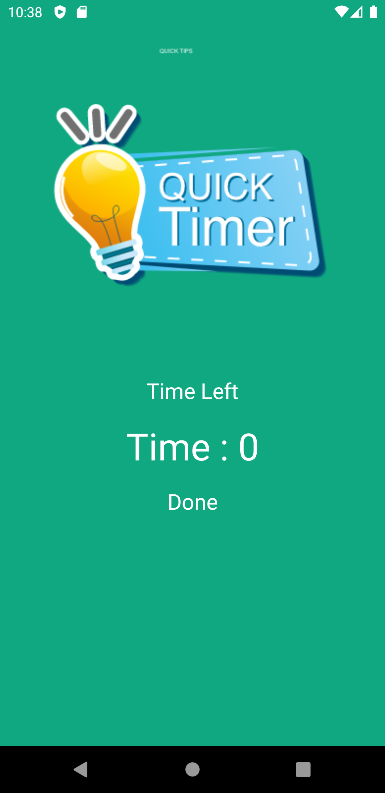

# Timer
Just a simple time tracker app, just as we have in quiz apps, etc.


## Countdown Timer Function
```
{
 new CountDownTimer(10000,1000){
            @Override
            public void onTick(long l) {
                mTimer.setText("Time : "+ String.valueOf(l/1000));
            }

}
```

       
